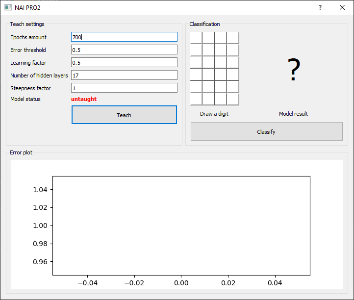
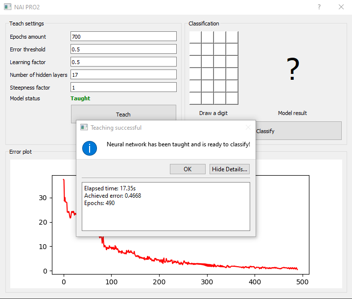
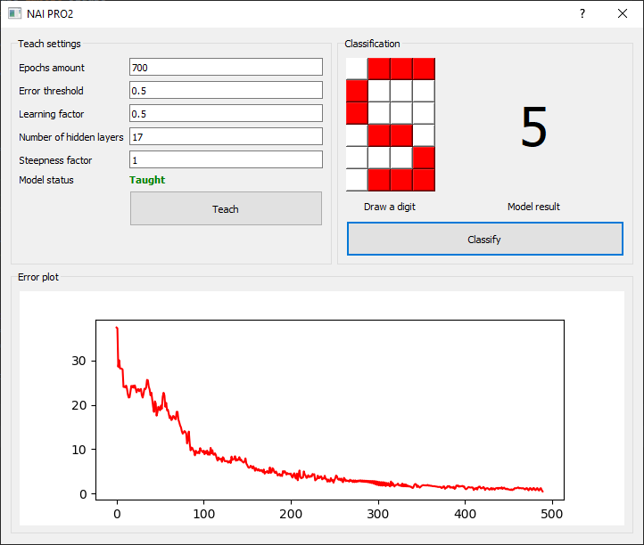
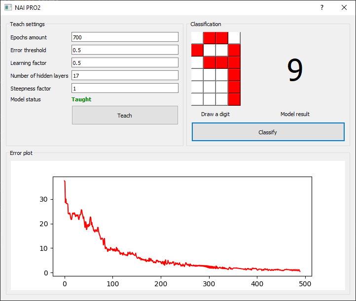

# 10 digits classification. Two-layer neural network
## Course
Tools of Artificial Intelligence
## Goal
Write from scratch two-layer neural network which will be able to recognise digits drawn in 4x6 matrix. 
program should recognise digits which are "similar" to the taught ones and has to include the following parameters:
* Number of hidden layers
* Epochs amount
* Error threshold
* Learning factor
* Steepness factor
## Screenshots

